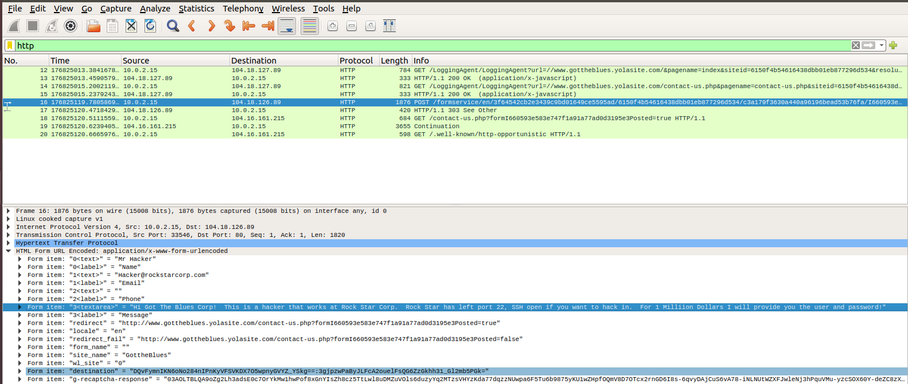
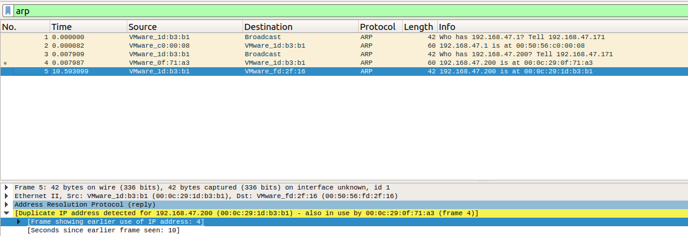

## Networking Fundamentals Homework: Rocking your Network!


### Network Vulnerability Assessment 

### **Phase 1**: _"I'd like to Teach the World to `Ping`"_

You have been provided a list of network assets belonging to RockStar Corp. Use `fping` to ping the network assets for only the Hollywood office.

  - Determine the IPs for the Hollywood office and run `fping` against the IP ranges in order to determine which IP is accepting connections.
```
sysadmin@UbuntuDesktop:~$ fping -g 15.199.95.91/28
15.199.95.81 is unreachable
15.199.95.82 is unreachable
15.199.95.83 is unreachable
15.199.95.84 is unreachable
15.199.95.85 is unreachable
15.199.95.86 is unreachable
15.199.95.87 is unreachable
15.199.95.88 is unreachable
15.199.95.89 is unreachable
15.199.95.90 is unreachable
15.199.95.91 is unreachable
15.199.95.92 is unreachable
15.199.95.93 is unreachable
15.199.95.94 is unreachable
sysadmin@UbuntuDesktop:~$ fping -g 15.199.94.91/28
15.199.94.81 is unreachable
15.199.94.82 is unreachable
15.199.94.83 is unreachable
15.199.94.84 is unreachable
15.199.94.85 is unreachable
15.199.94.86 is unreachable
15.199.94.87 is unreachable
15.199.94.88 is unreachable
15.199.94.89 is unreachable
15.199.94.90 is unreachable
15.199.94.91 is unreachable
15.199.94.92 is unreachable
15.199.94.93 is unreachable
15.199.94.94 is unreachable
sysadmin@UbuntuDesktop:~$ fping -g 11.199.158.91/28
11.199.158.81 is unreachable
11.199.158.82 is unreachable
11.199.158.83 is unreachable
11.199.158.84 is unreachable
11.199.158.85 is unreachable
11.199.158.86 is unreachable
11.199.158.87 is unreachable
11.199.158.88 is unreachable
11.199.158.89 is unreachable
11.199.158.90 is unreachable
11.199.158.91 is unreachable
11.199.158.92 is unreachable
11.199.158.93 is unreachable
11.199.158.94 is unreachable
sysadmin@UbuntuDesktop:~$ fping -g 167.172.144.11/32
167.172.144.11 is alive
sysadmin@UbuntuDesktop:~$ fping -g 11.199.141.91/28
11.199.141.81 is unreachable
11.199.141.82 is unreachable
11.199.141.83 is unreachable
11.199.141.84 is unreachable
11.199.141.85 is unreachable
11.199.141.86 is unreachable
11.199.141.87 is unreachable
11.199.141.88 is unreachable
11.199.141.89 is unreachable
11.199.141.90 is unreachable
11.199.141.91 is unreachable
11.199.141.92 is unreachable
11.199.141.93 is unreachable
11.199.141.94 is unreachable
```
Also indicate at which OSI layer your findings are found.
  - This is on the network layer.

### **Phase 2**:  _"Some `Syn` for Nothin`"_

With the IP(s) found from Phase 1, determine which ports are open:
```
root@UbuntuDesktop:/home/sysadmin# nmap -sS 167.172.144.11

Starting Nmap 7.60 ( https://nmap.org ) at 2022-04-06 10:00 EDT
Nmap scan report for 167.172.144.11
Host is up (0.016s latency).
Not shown: 999 filtered ports
PORT   STATE SERVICE
22/tcp open  ssh
```

Nmap done: 1 IP address (1 host up) scanned in 7.08 seconds


  - This information is found on the Transport Layer of the OSI model.


### Phase 3: _"I Feel a `DNS` Change Comin' On"_

  - Found SSH open and logged in with Jimi's credentials.

```
root@UbuntuDesktop:/home/sysadmin# ssh jimi@167.172.144.11
$ cat /etc/hosts
# Your system has configured 'manage_etc_hosts' as True.
# As a result, if you wish for changes to this file to persist
# then you will need to either
# a.) make changes to the master file in /etc/cloud/templates/hosts.tmpl
# b.) change or remove the value of 'manage_etc_hosts' in
#     /etc/cloud/cloud.cfg or cloud-config from user-data
#
127.0.1.1 GTscavengerHunt.localdomain GTscavengerHunt
127.0.0.1 localhost
98.137.246.8 rollingstone.com
```
  - Ran the IP found being redirected for rollingstone.com
```
root@UbuntuDesktop:/home/sysadmin# nslookup 98.137.246.8
8.246.137.98.in-addr.arpa	name = unknown.yahoo.com.
```
  - The domain of the redirected IP belongs to yahoo.com.
  - The DNS runs on the Application Layer.
 

 ### Phase 4:  _"Sh`ARP` Dressed Man"_
  **HTTP findings**
  - Found file left by hacker and ran through wireshark
  - Ran HTTP filter 
  - See message from hacker in attached immage
  
  - HTPP runs on the Application Layer.


  **ARP findings**
  - Ran ARP filter
  - Found duplicate IP address in the ARP responses. See attached image.
  
  - ARP runs on the Data-Link Layer.
