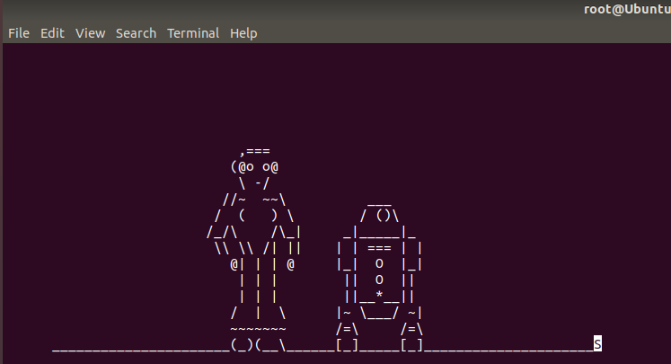

### Mission 1  

**Issue**: Due to the DoS attack, the Empire took down the Resistance's DNS and primary email servers. 
 
 - The Resistance's network team was able to build and deploy a new DNS server and mail server.

- The new primary mail server is `asltx.l.google.com` and the secondary should be `asltx.2.google.com`.


- The Resistance (starwars.com) is able to send emails but unable to receive any.

Your mission:

- Determine and document the mail servers for starwars.com using NSLOOKUP.

`nslookup -type=mx starwars.com`

```
root@UbuntuDesktop:/home/sysadmin# nslookup -type=MX starwars.com
Server:		8.8.8.8
Address:	8.8.8.8#53

Non-authoritative answer:
starwars.com	mail exchanger = 5 alt1.aspx.l.google.com.
starwars.com	mail exchanger = 5 alt2.aspmx.l.google.com.
starwars.com	mail exchanger = 10 aspmx3.googlemail.com.
starwars.com	mail exchanger = 10 aspmx2.googlemail.com.
starwars.com	mail exchanger = 1 aspmx.l.google.com.

```
- The new mail servers are not setup correctly. The correct setup should look like:
```
starwars.com    MX preference = 1, mail exchanger = asltx.l.google.com
starwars.com    MX preference = 5, mail exchanger = asltx.2.google.com
```

### Mission 2

- Run nslookup.
```
root@UbuntuDesktop:/home/sysadmin# nslookup -type=txt theforce.net
Server:		8.8.8.8
Address:	8.8.8.8#53

Non-authoritative answer:
theforce.net	text = "google-site-verification=XTU_We07Cux-6WCSOItl0c_WS29hzo92jPE341ckbOQ"
theforce.net	text = "v=spf1 a mx mx:smtp.secureserver.net include:aspmx.googlemail.com ip4:104.156.250.80 ip4:45.63.15.159 ip4:45.63.4.215"
theforce.net	text = "google-site-verification=ycgY7mtk2oUZMagcffhFL_Qaf8Lc9tMRkZZSuig0d6w"
```

- The new IPs need to be added to look like:
```
v=spf1 a mx mx:smtp.secureserver.net include:aspmx.googlemail.com ip4:45.23.176.21 ip4:104.156.250.80 ip4:45.63.15.159 ip4:45.63.4.215
```
  
### Mission 3

**Issue**: You have successfully resolved all email issues and the resistance can now receive alert bulletins. However, the Resistance is unable to easily read the details of alert bulletins online. 
  
- They are supposed to be automatically redirected from their sub page of `resistance.theforce.net`  to `theforce.net`.

Your mission:
  
- Document how a CNAME should look by viewing the CNAME of `www.theforce.net` using NSLOOKUP.

```
root@UbuntuDesktop:/home/sysadmin# nslookup -type=cname www.theforce.net
Server:		8.8.8.8
Address:	8.8.8.8#53

Non-authoritative answer:
www.theforce.net	canonical name = theforce.net.

```
  
- The canonical name for www.theforce.net is currently listed as theforce.net which is incorrect and should instead be listed as resistance.theforce.net
  
- The corrected DNS record should be `resistance.theforce.net        canonical name = theforce.net`
  
### Mission 4

 - Confirm the DNS records for `princessleia.site`.

```
root@UbuntuDesktop:/home/sysadmin# nslookup -type=ns princessleia.site
Server:		8.8.8.8
Address:	8.8.8.8#53

Non-authoritative answer:
princessleia.site	nameserver = ns25.domaincontrol.com.
princessleia.site	nameserver = ns26.domaincontrol.com.

```
- Add backup server.
```
princessleia.site	nameserver = ns25.domaincontrol.com.
princessleia.site	nameserver = ns26.domaincontrol.com.
princessleia.site	nameserver = ns2.galaxybackup.com
```

### Mission 5

- Document this shortest path so it can be used by the Resistance to develop a static route to improve the traffic.

> Batuu-D-C-E-F-J-I-L-Q-T-V-Jedha
  
### Mission 6

> Answer
```
Sender's MAC: Cisco-Li_e3:e4:01 (00:0f:66:e3:e4:01)
Sender's IP: 172.16.0.1
Target's MAC: IntelCor_55:98:ef (00:13:ce:55:98:ef)
Target's ip: 172.16.0.101
```

### Mission 7 

- Made it this far into the movie.


