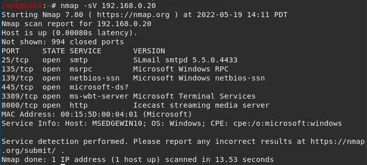
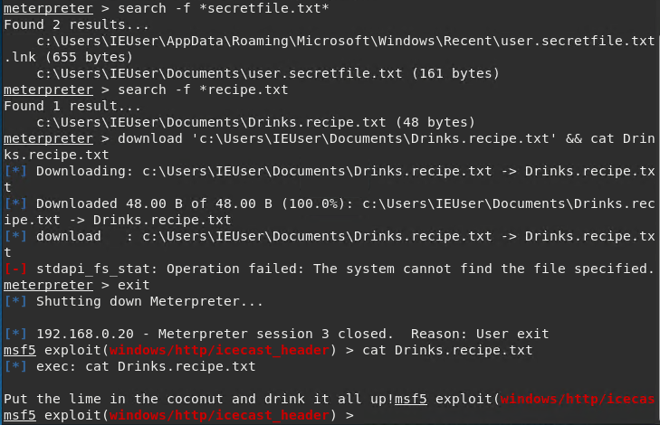

  
### GoodSecurity Penetration Test Report ###

JasonShallenberger@GoodSecurity.com

5/24/2022

**1.0 High-Level Summary**

GoodSecurity was tasked with performing an internal penetration test on GoodCorp’s CEO, Hans Gruber. An internal penetration test is a dedicated attack against internally connected systems. The focus of this test is to perform attacks, similar to those of a hacker and attempt to infiltrate Hans’ computer and determine if it is at risk. GoodSecurity’s overall objective was to exploit any vulnerable software and find the secret recipe file on Hans’ computer, while reporting the findings back to GoodCorp.
When performing the internal penetration test, there were several alarming vulnerabilities that were
identified on Hans’ desktop. When performing the attacks, GoodSecurity was able to gain access to his machine and find the secret recipe file by exploit two programs that had major vulnerabilities. The details of the attack can be found in the ‘Findings’ category.

**2.0 Findings** 

Machine IP: 192.168.0.20

Hostname: MSEDGEWIN10

Vulnerability Exploited: Icecast_header
``` exploit/windows/http/icecast_header ```

Vulnerability Explanation:
This exploit is a buffer overflow in the header parsing of Icecast 2.0.1 and earlier. Allows for an exploit in which an attack can remotely gain control of a victim's system by overwriting the memory on the sytem utilizing the Icecast flaw. This flaw writes past the enf of a pointer array when receiving 32 HTTP headers.

Severity:
The severity of this exploit is ranked high severity due to the fact that is takes a relatively low level of skill to accomplish the threat and the degree that you could exploit sensitive information from the target machines.  

Proof of Concept:
The first step was to run a nmap scan that looked for services, service versions and open ports. These were the results of that scan. 

 
After determining there was an outdated version of Icecast, ran the Icecast exploit to gain shell access.

 
Lastly, located on the vulnerable machine was a document containing a secret recipe for a drink. Easy IP theft.
 
 
Recommendations
Ensure all software is up to date, performing licenced application checks regularly. 
Icecast has a v 2.4.4 that is more stable and has patched some of their old vulnerabilities. I would also recommend they install a reputable antivirus software and keep all of their systems updated and patched. 


